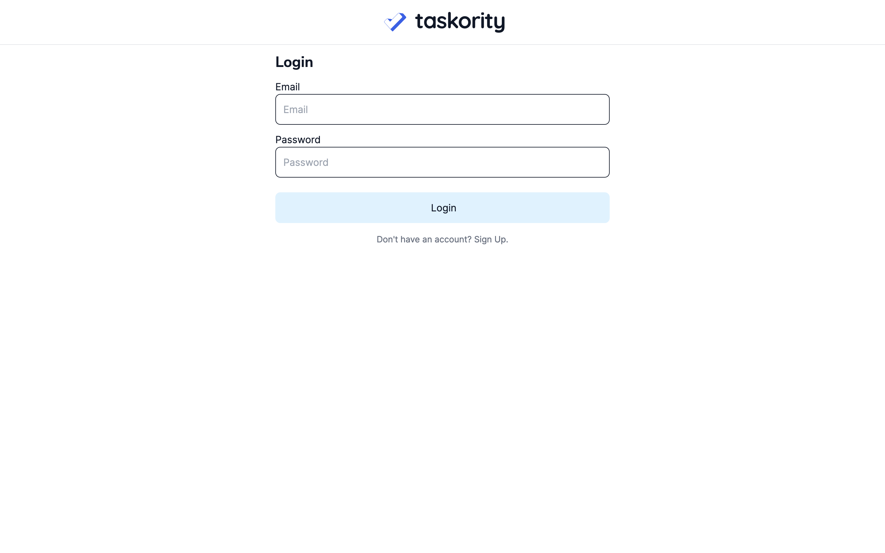
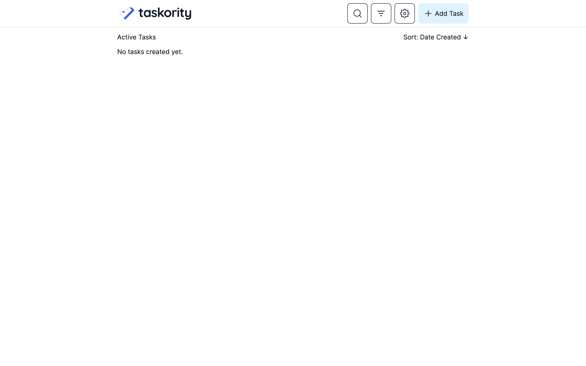
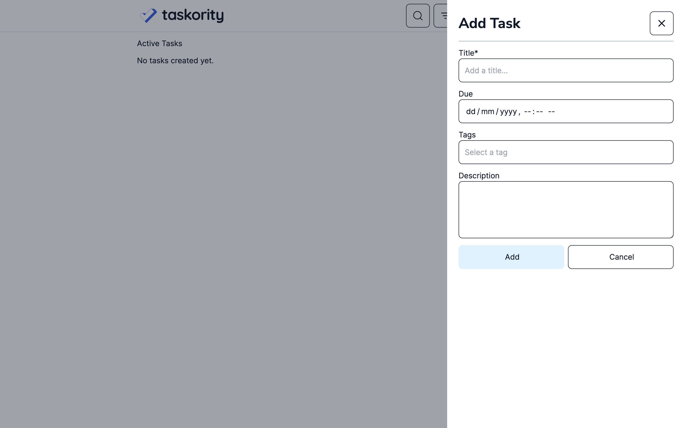
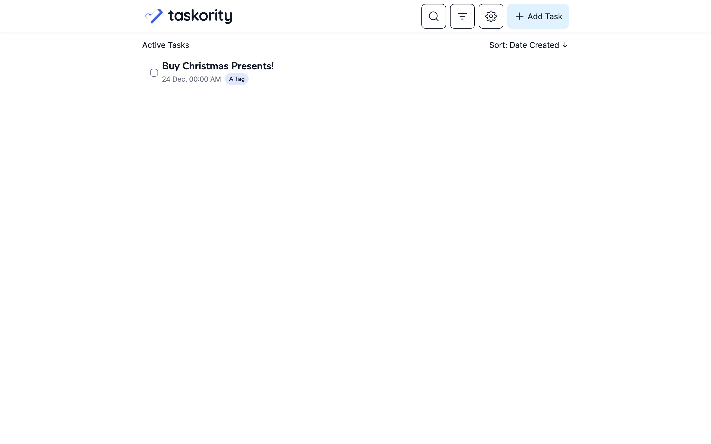
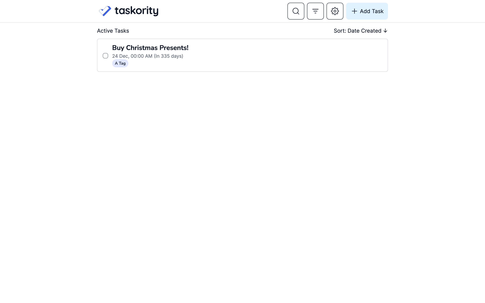
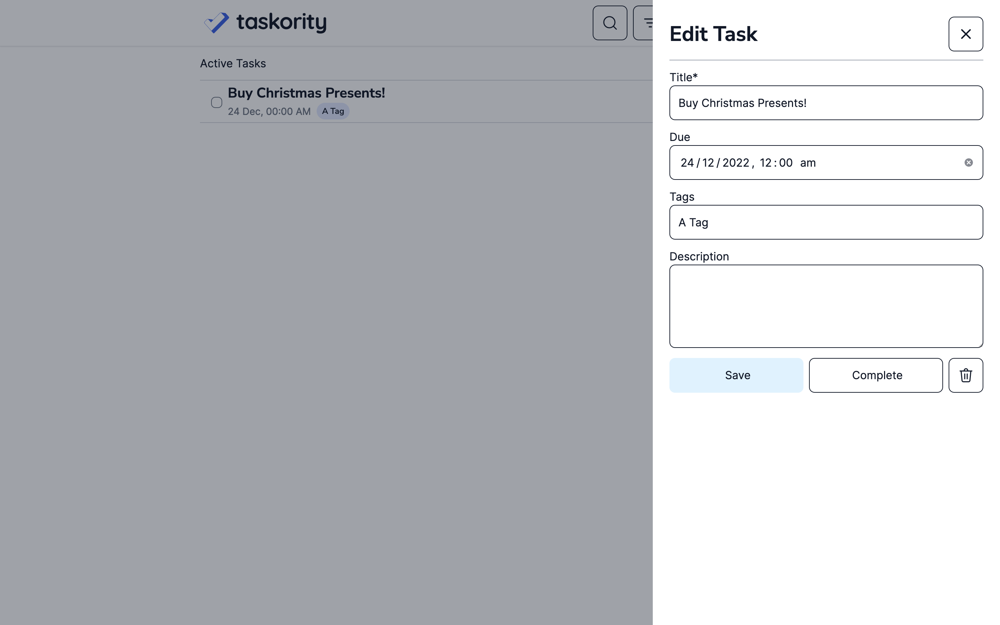
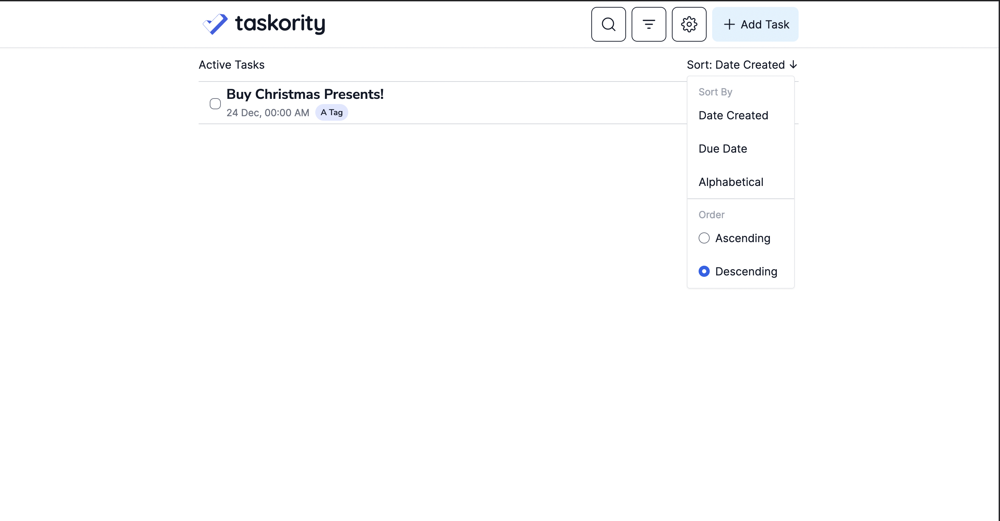
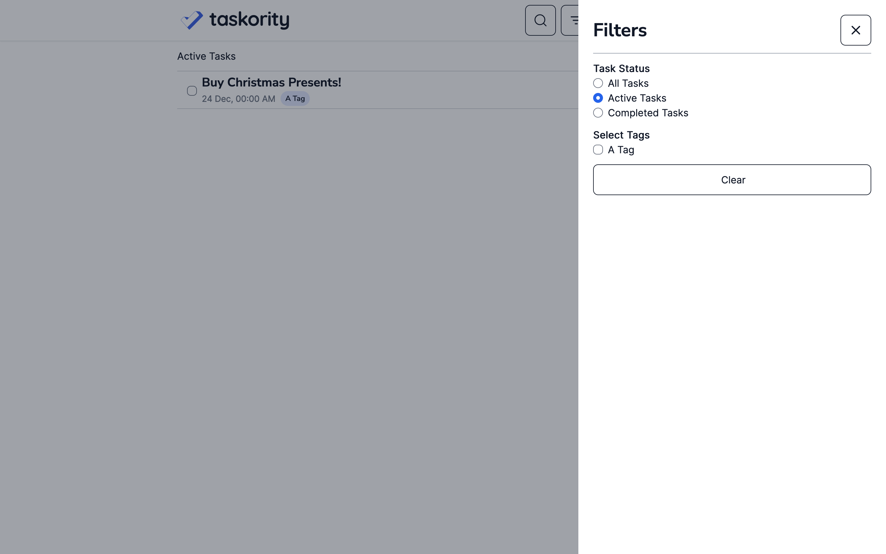
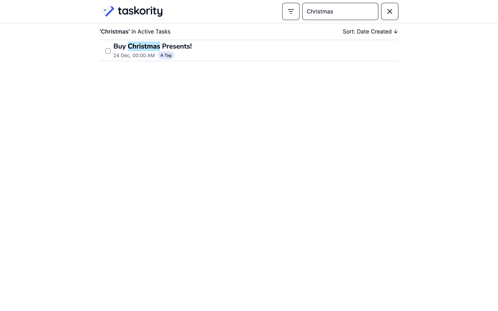
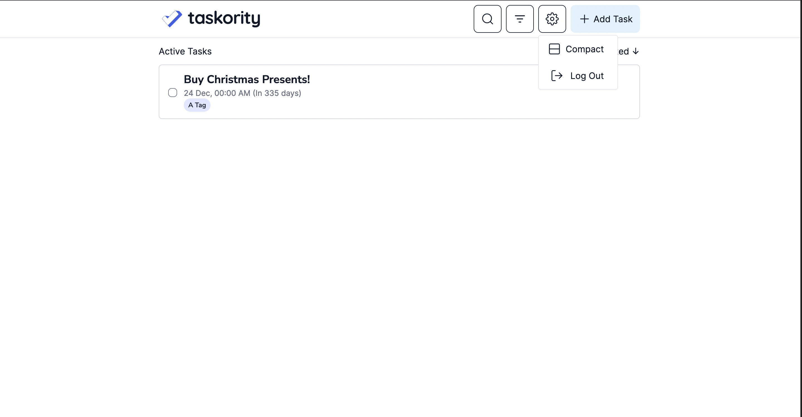

# Taskority

Access the working application [here](https://taskority.lesterong.com).

---
Taskority, a task manager developed for the 2021/2022 CVWO Assignment.

## User Guide
### Create an Account or Login

Key in your email and password to login to Taskority.

If you do not have an account yet, click on 'Don't have an account?', and sign up for an account using your email and password.

### Home Page
Upon login, you'll see the home page with your tasks.

### Managing Tasks
Create a new task by pressing on the '+ Add Task' button'. Enter the details of your task, and select 'Add'. You can add tags to your tasks to find your task easily in the future. If you do not wish to add the task, simply select 'Cancel'.

Tasks you create will show up on your home page. You can complete them by pressing on the checkbox.

You can toggle between the compact view and wide view in the settings.

If you need to edit the details of the task, just click on the task, and edit the details! You can also delete or complete the task from here.

### Sorting and Filtering
You can sort your tasks on your home page by clicking on 'Sort By:'

You can filter tasks by their tags or status by clicking on the filters button.

### Searching
You can search for tasks by their title by clicking on the search icon.

### Logging Out
When you're done with your tasks, you can logout by clicking on 'Log Out' in the Settings dropdown.

